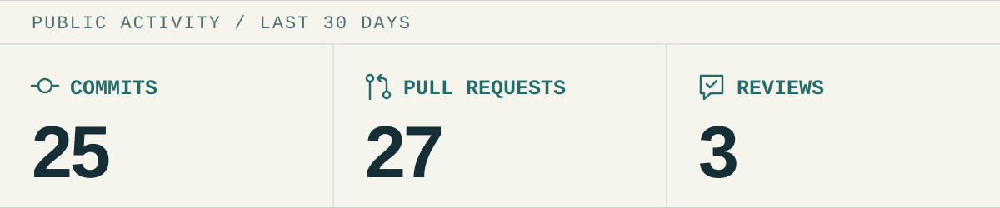

<picture>
  <source media="(prefers-reduced-motion: reduce) and (prefers-color-scheme: dark)" srcset="assets/hero-static-dark.svg">
  <source media="(prefers-reduced-motion: reduce)" srcset="assets/hero-static-light.svg">
  <source media="(prefers-color-scheme: dark)" srcset="assets/hero-dark.svg">
  
</picture>

Software engineer with a love for **mathematics, GPUs, and optimization.**

Mathematics · GPU Computing · Optimization · Quantum Computing

### Activity

<!-- ACTIVITY:START -->
<picture>
  <source media="(max-width: 600px) and (prefers-color-scheme: dark)" srcset="assets/activity-mobile-dark.svg">
  <source media="(max-width: 600px)" srcset="assets/activity-mobile-light.svg">
  <source media="(prefers-color-scheme: dark)" srcset="assets/activity-dark.svg">
  
</picture>

**Recent activity**

- `Sep 21` **Pushed** [build\(deps\): bump soupsieve from 2\.8\.4 to 2\.9 \(\#402\)](https://github.com/amachino/qubex/commit/2bf4160feee692f9ec2ff81b41f9eb440d3ba659) — amachino/qubex · develop
- `Sep 18` **Pushed** [fix: stabilize QuEL\-3 retries and frame shift carryover \(\#404\)](https://github.com/msk-ono/qubex/commit/66c67c387eeafa7eff6f673260d8d0886c6cf0fc) — msk\-ono/qubex · develop
- `Sep 18` **Pushed** [fix: stabilize QuEL\-3 retries and frame shift carryover \(\#404\)](https://github.com/amachino/qubex/commit/66c67c387eeafa7eff6f673260d8d0886c6cf0fc) — amachino/qubex · develop
- `Sep 18` **Merged** [fix: stabilize QuEL\-3 retries and frame shift carryover](https://github.com/amachino/qubex/pull/404) — amachino/qubex · \#404
- `Sep 18` **Opened** [fix: stabilize QuEL\-3 retries and frame shift carryover](https://github.com/amachino/qubex/pull/404) — amachino/qubex · \#404

Public activity · Last 30 days · Updated 2026-09-23 21:34 UTC

[About these counts](https://docs.github.com/en/account-and-profile/reference/profile-contributions-reference)
<!-- ACTIVITY:END -->
