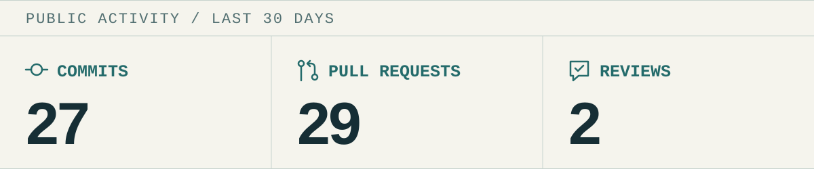

<picture>
  <source media="(prefers-reduced-motion: reduce) and (prefers-color-scheme: dark)" srcset="assets/hero-static-dark.svg">
  <source media="(prefers-reduced-motion: reduce)" srcset="assets/hero-static-light.svg">
  <source media="(prefers-color-scheme: dark)" srcset="assets/hero-dark.svg">
  
</picture>

Software engineer with a love for **mathematics, GPUs, and optimization.**

Mathematics · GPU Computing · Optimization · Quantum Computing

### Activity

<!-- ACTIVITY:START -->
<picture>
  <source media="(max-width: 600px) and (prefers-color-scheme: dark)" srcset="assets/activity-mobile-dark.svg">
  <source media="(max-width: 600px)" srcset="assets/activity-mobile-light.svg">
  <source media="(prefers-color-scheme: dark)" srcset="assets/activity-dark.svg">
  
</picture>

**Recent activity**

- `Oct 01` **Merged** [fix\(quel3\): attenuate gains by 3 dB and expand secret paths](https://github.com/amachino/qubex/pull/417) — amachino/qubex · \#417
- `Oct 01` **Opened** [fix\(quel3\): attenuate gains by 3 dB and expand secret paths](https://github.com/amachino/qubex/pull/417) — amachino/qubex · \#417
- `Oct 01` **Pushed** [fix: return filtered CKP figures for QDash \(\#416\)](https://github.com/amachino/qubex/commit/fe3b2b9c92247739a26231e105d273bf17b4c699) — amachino/qubex · develop
- `Sep 30` **Pushed** [chore\(deps\): update quelware\-client to 0\.7\.2 and quelware\-core to 0\.9\.0 \(\#411\)](https://github.com/msk-ono/qubex/commit/09260aeb9b8461fe252c3f155ac1d077011a2a41) — msk\-ono/qubex · develop
- `Sep 29` **Pushed** [chore\(deps\): update quelware\-client to 0\.7\.2 and quelware\-core to 0\.9\.0 \(\#411\)](https://github.com/amachino/qubex/commit/09260aeb9b8461fe252c3f155ac1d077011a2a41) — amachino/qubex · develop

Public activity · Last 30 days · Updated 2026-10-01 22:45 UTC

[About these counts](https://docs.github.com/en/account-and-profile/reference/profile-contributions-reference)
<!-- ACTIVITY:END -->
